# Atlas usability assessment (U0, round 2)

**What this is.** A walk through every screen and state of the **live** Atlas as a first-time user
would meet it, with screenshots, written up as observed behaviour. It ends with ranked findings, a
proposed shell layout and mockups for Ben's decisions R1–R5. Round 1 showed the Atlas matches the two
Shiny apps it replaces; this document asks whether it is pleasant to use.

**What was tested.** `https://marinesensitivity.org/atlas/` (public release v7), serving app
**0.10.21** (`89895b1`; the version string was checked in the live bundle). The walk ran on
2026-09-23. It was scripted in Playwright against the live site and live bucket, so it is **not**
hermetic. It covered chromium in full, with one pass each on WebKit and Firefox.

**How it was done.** No feature code was written. The walk is committed and repeatable:

- The walks are `scripts/usability/walk-{scores,species,places,report,viewports,phone,keyboard,compare}.mjs`.
- The two probes are `probe-{coverage-race,report-hash}.mjs`, and the timing script is `timing.mjs`.
- All of them share helpers in `lib.mjs`. Run one with `TMPDIR=$PWD/.tmp node scripts/usability/<file>`.
- Screenshots are in `docs/usability/` as JPEG q70. The raw observation logs each finding cites are
  in `docs/usability/obs/*.json`.
- The mockups are `docs/design/mockups/r2/`. Candidate tokens are `docs/design/candidates/`, the one
  place outside `tokens.css` allowed to hold colour literals, because each file is a full copy of it.

**Known defects.** These were already known going in (the atlas-8 phase review of 0.10.21) and are
**ranked here, not re-reported as news**:

- M1: a scores map click does nothing while the desktop panel is collapsed or the Places tool is open.
- Report is a placeholder.
- There is no legend on the phone.
- The theme defaults to `auto`.
- The scores search box has no handler.
- There is no link to the Docs or the home page.
- A first-paint regression on laptops is being root-caused in parallel. Load time is **noted**
  below, not chased.

---

## 0. Summary

The Atlas already does things the Shiny apps never did. It computes reports in the browser, gives
four export formats, keeps the URL as the view, and has a solid keyboard and focus model. The DOCX
export carries the right numbers. The core **flows** are what break.

A first-time user who follows the words on screen ("Pick mode on. Click a Program Area…", "Report")
does not reach a report. On a phone they cannot leave the Layers panel at all. The two numbers a place
panel shows can belong to a different place. Most of the rest is ordinary unfinished chrome:

- a tour that is a stub
- a Report button that is a placeholder
- panels that neither resize nor maximize
- About and feedback parked bottom-left
- palettes that grey the map

**Top ten, ranked by what they cost a user** (full table in §4):

| #   | Sev. | Finding (seen in)                                                                                                                                                                                                                                                                        | Owner                                                                                                    |
| --- | ---- | ---------------------------------------------------------------------------------------------------------------------------------------------------------------------------------------------------------------------------------------------------------------------------------------- | -------------------------------------------------------------------------------------------------------- |
| 1   | B    | **A place's results can be another place's.** One 18,354 km² box reads 0.0 %, 100.0 % and 200.0 % "inside the study area" (1,344 of 672 cells) from run to run. The uploaded Monterey box showed the Gulf box's 31.3 composite under its own name; `report.html` gives it 39.            | `src/places/results.ts:49-55`, `src/lib/analysis/queries.ts:90-121`                                      |
| 2   | B    | **Places → Report drops every drawn or typed place.** Three places in, "Done — 1 place" out. The footer puts `sel.pl` into the hash once-encoded, and `report.html` cannot parse a name with a space. The default names "Drawn place 1" and "bounding box" have spaces.                  | `src/places/Places.svelte:542`                                                                           |
| 3   | B    | **Pick mode cannot pick a Program Area.** Clicking inside one does nothing, with Spatial units on cells or on Program areas. Only the 1-px outline layer is ever queried.                                                                                                                | `src/shell/Shell.svelte:808` → `src/places/pickInstall.ts:45-47` → `src/lib/map/layers/zones.ts:106-111` |
| 4   | B    | **Phone: only the Layers panel is reachable.** The bottom tool rail sits under the sheet at every detent (rail `z-index` 15, panel 16). There is no species search on the phone.                                                                                                         | `src/shell/shell.css:329-340, 393-399, 434`; `src/shell/Shell.svelte:690`                                |
| 5   | B    | **"Download HTML" is unreadable.** It is white text on a light page, because the exported `<html>` has no `data-theme` and falls back to the navy tokens. The seal is a remote URL, so it is gone offline.                                                                               | `src/report/exportHtml.ts:40`; `src/report/Report.svelte:174-175`                                        |
| 6   | M    | **The top bar's "Report" is a placeholder** ("The report builder arrives in a later phase"), with or without places. The working path to a Program Area report is hidden: Table → Zones → tick a row → "Report on selected".                                                             | `src/shell/Shell.svelte:202-204`, `src/shell/tools.ts:44-50`                                             |
| 7   | M    | **Three of the four palettes break the map.** With Viridis, Cividis or Magma on Program Areas every zone paints flat grey. On cells the legend disappears ("not published a legend ramp for this palette yet"). Releases publish stops for `spectral_r` only.                            | `src/lens/scores/zoneFill.ts:63-80`, `src/lens/scores/ScoresLegend.svelte:43`                            |
| 8   | M    | **A collapsed panel kills the scores map click** (M1). Clicking a rail tool does not reopen it either: the pill's label changes and nothing else happens.                                                                                                                                | `src/lens/scores/ScoresLens.svelte:133-182`, `src/shell/Shell.svelte:177-180`                            |
| 9   | M    | **The first view hides the study area.** The camera is a constant, centred on Canada at zoom 2.16. The 380 px panel covers the Atlantic, the eastern Gulf and Puerto Rico, and on a phone the sheet covers the US. The basemap first paints at 8.6–14 s and the score raster at 10–21 s. | `src/lib/map/interaction.ts:38-44`, `src/lib/map/map.ts:111`                                             |
| 10  | M    | **"Take a Tour" and Help are stubs.** The welcome modal says "scores" and shows on every deep link, including species links and not-found links, covering what the sender meant.                                                                                                         | `src/lens/scores/WelcomeModal.svelte:33-34, 48-49`; `src/shell/Shell.svelte:206-209`                     |

**The layout in five lines:**

1. **Top bar.** Mark and title, then the version chip. Next comes the lens switch with a search box
   that follows the lens. Last, `Report` as the primary action, then Share, Send feedback, (i) About,
   (?) Help (tour, docs, keyboard) and a sun/moon toggle.
2. **Tool rail.** A labelled vertical stack on desktop; on a phone, a bottom tab bar that the sheet
   can never cover.
3. **Panel.** One dockable panel, right by default. It docks left, right or bottom, resizes by
   dragging its edge, maximizes to the whole stage and collapses to an edge pill. Clicking any rail
   tool reopens it. The layout is remembered per viewport (chrome, not URL).
4. **Map chrome.** The legend and scale bar go bottom-left. Zoom, globe/flat and "fit study area" go
   at the map's top-right. The camera is padded for the panel or sheet, so the study area is never
   underneath it.
5. **Layers.** One panel that is the layer stack in draw order. Its first row is the lens's data layer
   (ramp, opacity), which expands into today's controls. Below it come outlines, labels, bathymetry
   and the basemap.

---

## 1. Coverage and method

| Viewport               | Dark (`?theme=dark`)                                         | Light (`?theme=light`)                           | Engine          | Input              |
| ---------------------- | ------------------------------------------------------------ | ------------------------------------------------ | --------------- | ------------------ |
| 1280×800 (primary)     | every state in §3                                            | first visit on an OS set to light (theme `auto`) | chromium        | pointer + keyboard |
| 1440×900               | default                                                      | default                                          | chromium        | pointer            |
| 1024×768 (tablet)      | default (the light run had no finding of its own)            | —                                                | chromium        | pointer            |
| 390×844 (phone, touch) | welcome, default, detents, tap, species, rail                | default                                          | chromium        | touch              |
| 1280×800               | default + Table + Tab order                                  | —                                                | WebKit, Firefox | pointer + keyboard |
| 1280 → 860 → 1280      | resize across the 900 px breakpoint with the Table tool open | —                                                | chromium        | —                  |

Each walk starts in a fresh browser context, like a first-time visitor with empty `localStorage`.
The report walk accepted every download and opened it:

- the DOCX was unzipped and its `document.xml` read
- the ZIP was listed and its scores CSV read
- the HTML was opened with the context **offline**

**Not exercised, and why:**

- **A truly non-US species.** On v7 every one of 16,153 taxa carries the US flag (`app/taxa.json`
  `flags` = 1 throughout), so "Only species in US waters" is a no-op there. wrybill, kakapo, Sotalia
  and the penguins are not in the v7 index at all.
- **The Delivered / As-ingested toggle.** It exists only for on-grid datasets (AquaX, v9). v7 shows no
  representation control; the `representation` group was empty on every species.
- **The real print dialog.** Headless chromium does not open one. I checked that `Print` calls
  `window.print()` once and printed the report to PDF with print media: 5 US-Letter pages.
- **Sending feedback.** "Report a problem" lands on GitHub's login page; I did not sign in.
- **GeoPackage upload** (the lazy ~22 MB DuckDB `spatial` fetch) and drawing by touch.
- **The preview host and the restricted releases.** They are not deployed.
- **`gallery.html`.** It returns 404 on Pages because it is not published.
- **A screen reader.** No VoiceOver or NVDA session.

---

## 2. First impression and load

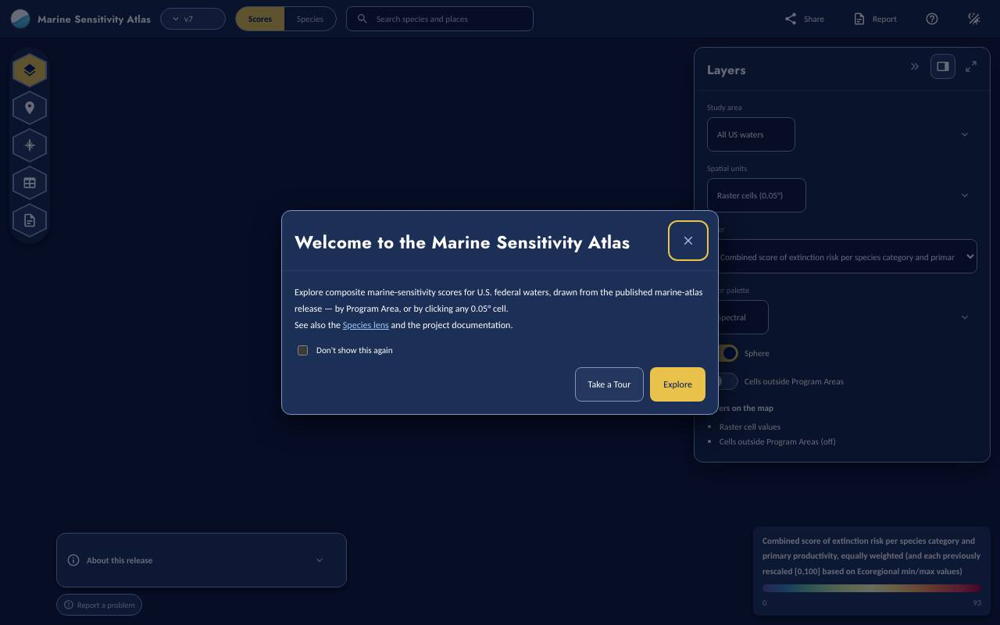

On a cold load at 1280×800 (`timing.mjs`, three runs, `obs/obs-timing.json`):

| Mark                                             | Run 1  | Run 2  | Run 3  |
| ------------------------------------------------ | ------ | ------ | ------ |
| DOMContentLoaded                                 | 0.5 s  | 1.8 s  | 0.7 s  |
| welcome modal visible                            | 3.9 s  | 3.4 s  | 2.7 s  |
| basemap's first painted pixels (MapLibre canvas) | 8.6 s  | 14.0 s | 10.0 s |
| score raster's first saturated pixels            | 21.3 s | 14.0 s | 10.0 s |

A user who clicks **Explore** at about 4 s stares at an empty navy disc for 5–17 s. That is
`scores-default-1280-dark.jpg`, taken right after Explore. In the light theme the empty disc is white
and it stayed that way in two separate runs past 12 s (`scores-default-1280-light.jpg`), although the
style already listed 93 basemap layers and the score raster. The page gives no loading indicator
while this happens. By contrast, CalCOFI shows "building slice…" over its map. Not chased here; see
the parallel first-paint work.

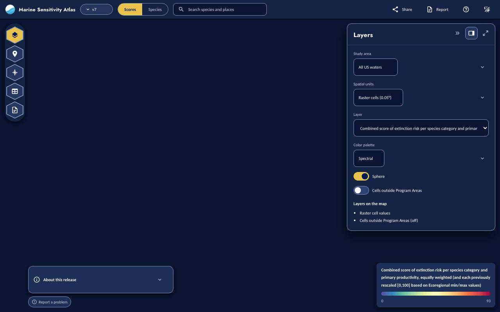
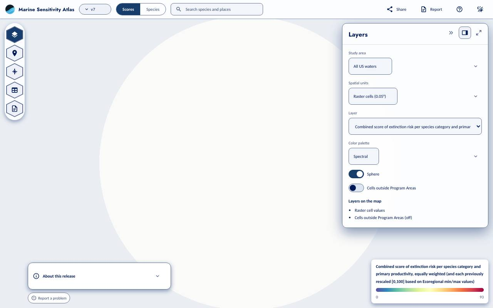

---

## 3. The walk, screen by screen

Each item below is written as the user sees it: "did X, expecting Y, got Z".

### 3.1 Welcome modal and version picker

**What a first-timer wants:** to find out what this is and start.

- **The modal lands correctly.** It appears at about 3 s with focus on its Close button. Tab cycles
  inside it (Species lens → checkbox → Take a Tour → Explore → Close), and Esc closes it. After it
  closes, **focus falls to `<body>`**, so the next Tab starts again from the skip link
  (`obs-keyboard.json`, `welcome-esc`).
- **"Take a Tour" is a stub.** Clicking it expecting a tour, I got a live-region announcement ("Guided
  tour arrives in a later phase") while the modal **stayed open** (`obs-scores.json`, `take-a-tour`).
- **The copy is scores-only** ("Explore composite marine-sensitivity scores…"). It also appears over a
  species deep link and over a not-found species link, covering what the link was sent to show
  (`species-deeplink-bogus-sp-1280-dark.jpg`).
- **`?tour=off` does not suppress it.** It only hides the Tour button. The component's own header
  says it should suppress the modal (`WelcomeModal.svelte:2-3` against `:33-34`).
- **The version chip opens a clear release list.** It shows restricted rows with "Continue on the
  preview host" and retired rows with "Switch" (`shell-versionpicker-1280-dark.jpg`). Esc returns
  focus to the chip. The list takes about 80 % of the viewport height for 12 rows.

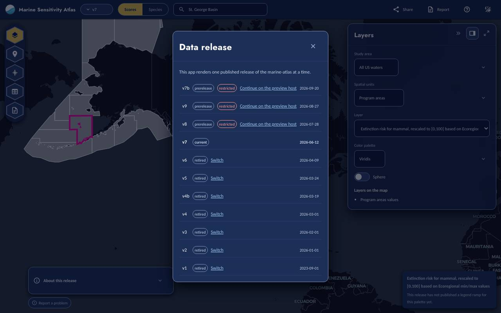

### 3.2 Scores lens

**What a first-timer wants:** to see which areas score high, click one to learn why, and compare
Program Areas.

- **The Layers panel reads as a form, not a map legend.** It holds Study area, Spatial units, a long
  Layer select, Color palette, Sphere and Cells outside Program Areas, then a _static_ bullet list
  headed "Layers on the map".
  - The native selects are narrower than their row, so each chevron floats at the far edge, detached
    from its box (Study area select 113 px in a 346 px row; `obs-scores.json`, `layers-selects`).
  - The Layer names are the raw metric sentences ("Combined score of extinction risk per species
    category and primary productivity, equally weighted (and each previously rescaled [0,100]…"). They
    truncate in the select and fill the legend with three lines of text.
- **Hovering a Program Area does nothing.** The cursor stays "grab" and no popup appears. Shiny
  repaints the hovered zone and shows its name.
- **A cold cell click gives no feedback.** I clicked a Gulf cell expecting a value. The URL gained
  `sel=cell:3437589` at once, but **no popup appeared within 3.5 s**: the value waits for the DuckDB
  engine to start, with no spinner. When it arrived, the popup was a four-line sentence ending
  ": 25" (`scores-cellpopup-1280-dark.jpg`). It then stays on the map while you switch tools.
- **The Flower** shows a centre number (25) and coloured petals with **no petal labels or legend**,
  and the page does not say which petal is which. Its text summary prints raw doubles: "Bird
  65.57377049180327, Coral 4.141374153250639…" (`scores-flower-1280-dark.jpg`; `flowerGeometry.ts:235`).

  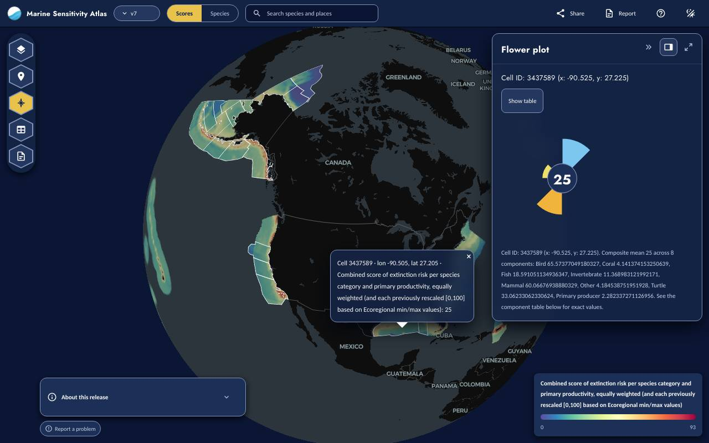

- **The Table** shows 11 species columns inside a 380 px panel, which scroll sideways; a user cannot
  widen the panel (`scores-table-1280-dark.jpg`). **Composition** is a one-level treemap with
  small labels (`scores-treemap-1280-dark.jpg`).
- **Clicking a Program Area** (with Spatial units set to Program areas) gives a popup reading
  "**GEO: 34**": a code, not "St. George Basin" (`scores-zonepopup-1280-dark.jpg`; data defect 3c,
  zone rows carry no `name`).
- **The palette select breaks the map.** Choosing Viridis turned every Program Area **flat grey**, and
  the legend changed to "This release has not published a legend ramp for this palette yet"
  (`scores-mammal-viridis-1280-dark.jpg`). On raster cells the tiles do repaint in Viridis, but the
  legend is replaced by the same note: the viewer loses the scale.

  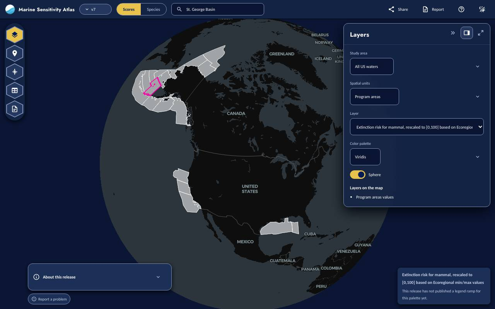

- **Globe → flat works.** The Sphere switch flips to Mercator and the change is written to the URL
  (`proj=mercator`).
- **"Full height" has no visible effect.** It left the panel at 476 px, the content height,
  expecting it to fill the screen (`scores-panelfull-1280-dark.jpg`). Nothing resizes, moves or
  maximizes.
- **Collapsed:** the panel becomes a 55 px "Layers" pill floating at x≈888, mid-top, not at an edge.
  - A map click then does nothing (M1; `scores-collapsed-1280-dark.jpg`).
  - Clicking the rail's Layers button, or any other tool, does **not** reopen the panel. Only the
    pill's text changes, for example to "Table".

  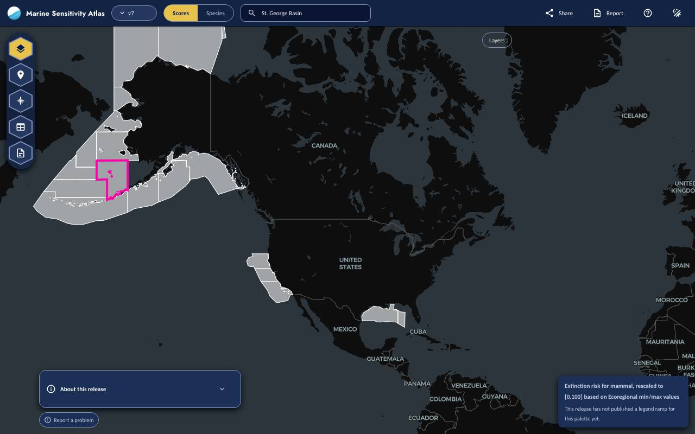

- **The Report tool** in the rail, and the top bar's **Report** button, both show "The report builder
  arrives in a later phase." (`scores-reporttool-1280-dark.jpg`).
- **The search box** ("Search species and places") accepts text and does nothing on Enter.
- **Share** copied the full URL to the clipboard and announced it.
- An uncaught `The layer 'programarea_ln' does not exist … cannot be queried` error fired from the
  scores click handler during the walk (`obs-scores.json`, `errors`). It comes from
  `queryRenderedFeatures` with a layer list that includes a layer absent from the current style
  (`interaction.ts:176-179`).

### 3.3 Species lens

**What a first-timer wants:** to find a species and see where it lives.

- **Switching to Species opens a species nobody asked for.** It auto-selects the leatherback (from
  `?sp=54241`) after about 5.8 s, with no hint why.
- **Search works but is cramped, and the obvious match is buried.** Typing "humpback" gives 18
  results; **the humpback whale is 6th**. All 18 tie on "common-name prefix" and fall back to
  alphabetical by scientific name.
  - The dropdown is 138 px wide, so each result wraps to three lines (`species-search-1280-dark.jpg`).
  - The input is a bordered box inside a bordered pill.
- **The species card** shows the merged model as a filled pill. Every input with no published
  surface, 5 of 6 for the leatherback, is a **struck-through** pill. Struck-through reads as
  "deleted" or "wrong", not "not available in this release". In Shiny v7 the same pills are
  clickable (`compare-shiny-species-1280-dark.jpg`).

  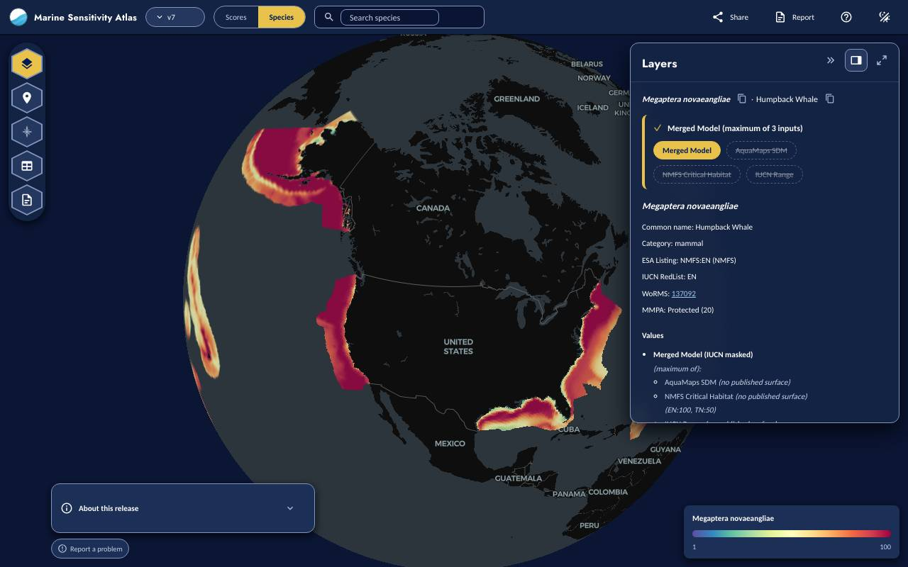

- **Clicking the map gives the value.** A click in the Gulf of Maine returned "Value: 89" with the
  cell id and lon/lat. The popup ran **under the panel**, its scientific name cut at the panel's edge
  (`species-clickvalue-1280-dark.jpg`).
- **The legend** is titled with the scientific name and "1 … 100", without saying what 1–100 means
  (suitability).
- **"Only species in US waters" does nothing on v7.** See §1.
- **The rail is mostly dead in Species:**
  - Flower is faded ("Flower plot — Scores only").
  - Table shows "The species and zone tables arrive in a later phase".
  - Report is the placeholder.

  So 3 of 5 rail tools do nothing here.

- **Deep links:**
  - A legacy `?mdl_seq=54383` resolves to the walrus, but rewrites the URL to
    **`?sp=54383&rep=undefined&us=0`**. That writes a literal "undefined" and silently turns US-only
    off (`src/lens/species/state.svelte.ts:225`).
  - A bogus `sp=` shows the welcome modal, with "Couldn't load this species (not-found)." in the panel
    behind it; the raw code sits in parentheses.
  - A bogus `lyr=` or `sel=cell:999999999` is ignored silently.
  - `?ver=v99` opens the picker with "v99 is not a version this host recognizes." Good.

### 3.4 Places

**What a first-timer wants:** to outline an area (a lease block, a project) and get its numbers.

- **The empty state** explains itself ("Turn on pick mode and click a Program Area, draw a shape,
  enter coordinates, or drop a file on the map") (`places-empty-1280-dark.jpg`).
- **Pick mode fails.** I switched it on; the announcement said "Click a Program Area to select it".
  I clicked inside the Western Gulf, first with raster cells, then again with Spatial units set to
  Program areas. **"Add to places" stayed disabled both times** (`places-pick-programarea-1280-dark.jpg`).
  The Places panel receives the shell's outline-only `zoneUnits` (`Shell.svelte:808`), so the pick
  query only asks the 1-px `programarea_ln` layer.
- **Drawing works.** I chose Polygon, clicked four corners and closed on the first. The place was
  added (18,354 km²) and the map outline turned magenta (`places-draw-1280-dark.jpg`). Then:
  - The row said **"not analysed yet"** and "—" for coverage, and kept saying so after the analysis
    had run.
  - For the first 10 s after drawing, **no result appeared** until "Show analysis cells" was toggled
    (`obs-coverage-race.json`).
- **Show analysis cells** painted the covered cells as a solid magenta block. The line under it read
  **"200.0 % of this place is inside the US study area (1,344 of 672 cells)"**
  (`places-cells-1280-dark.jpg`). Across runs the same box read 100.0 % (672 of 672), 0.0 % (0 of 672)
  and 200.0 %. Every place analysis writes the shared `place_cell`/`place_cell_sa` tables with
  `CREATE OR REPLACE` + insert across awaits (`results.ts:49-55`, `queries.ts:90-121`), so two
  concurrent analyses interleave. The same run put **the Gulf box's scores (31.3, Bird 99.1) under the
  uploaded Monterey box's name**; the report computes that box at 39 (Bird 70) (`obs-places.json`,
  `places-panel` against `obs-report.json`, `route-a-report`).

  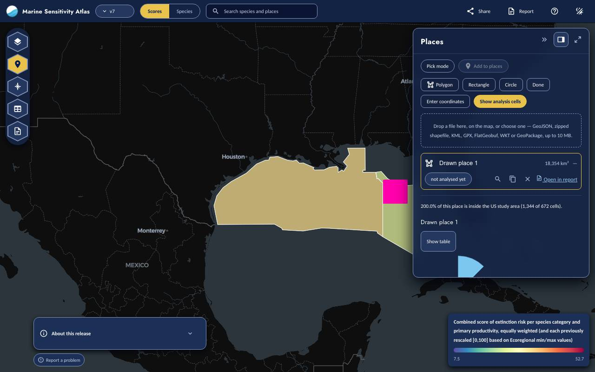

- **Enter coordinates** takes a bbox, vertices, WKT or GeoJSON, and worked. Its sample values look
  like pre-filled content (`places-coords-1280-dark.jpg`).
- **Uploading a GeoJSON** (one polygon off Monterey) worked. **The map did not move to the
  new place**, which was off-screen (`places-upload-1280-dark.jpg`). Neither did an entered one.
- **Share** gives a clear dialog: "This link carries the current release, the scores lens, the current
  map view, 3 places. Link length: 247 characters." (`places-share-1280-dark.jpg`).
- **The panel's own action row is below the fold at 1280×800.** Share, Download places and **Report**
  sit in a scroll area 636 px tall inside a 480 px panel body (`obs-report.json`, `route-a-footer`).
  The main call to action is invisible until you scroll the panel.

### 3.5 The Report flow, end to end

**What a first-timer wants:** "I selected an area; give me the report."

1. **Top bar "Report" with no place:** placeholder. **With three places:** still the placeholder.
2. **Places footer → Report with three places** (drawn, coordinates, uploaded): `report.html` opens
   in a new tab, finishes in 8.8 s and says **"Done — 1 place."** Only `upload-test` survives. The
   permalink printed in the header carries only that one (`report-places-1280-light.jpg`).
   - Cause, verified by `probe-report-hash.mjs` (`obs-report-hash.json`): the footer writes
     `#pl=${sel.pl}` (`Places.svelte:542`). That leaves each place name encoded **once**
     (`Drawn%20place%201`), which `report.html` decodes to an unparseable token → "Map: 0 places".
   - The per-row "Open in report" link builds its hash with `URLSearchParams`
     (`Places.svelte:499-506`), so it survives.
   - Names without spaces (`upload-test`) survive either way.

   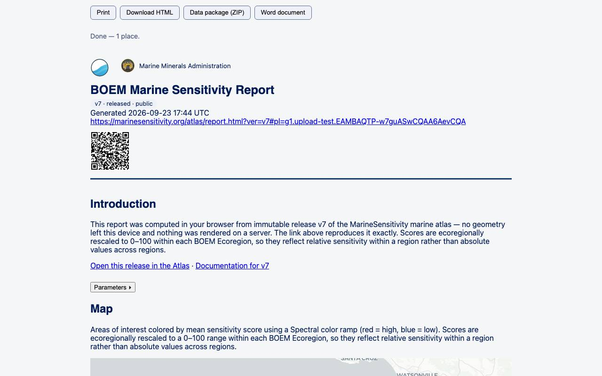

3. **The path that works** is hidden three levels deep: Table → Zones → tick HOP and COK → "Report
   on selected (2)". It gives a report that is "Done — 2 places" in 6.6 s (`report-zones-1280-light.jpg`,
   `report-zones-full-1280-light.jpg`).
   - **The numbers agree with the app.** HOP 4,509 cells with overall 53, and COK 1,523 cells with 53;
     the app's zone table shows 52.7 and 52.6.
   - **The map does not frame the two Program Areas.** It draws North America with world copies and
     no visible polygons. Zone places are framed from `label_pt`, which v7 zones do not carry
     (`reportMap.ts:42-53` + data defect 3c).
   - The legend is degenerate ("ramp 53 to 53").
   - The flower has no petal labels.
4. **Print:** the button calls `window.print()` once. Printed with print media, the report is 5
   Letter pages.
5. **Download HTML** (194 KB) opened offline:
   - **the heading and body are white on the light page** (`report-offline-1280-light.jpg`);
   - the seal is a broken image, because `Report.svelte:174-175` loads it from
     `https://marinesensitivity.org/branding/mma-seal.svg`;
   - the MST mark, the QR code and the map are embedded data URIs and do survive.

   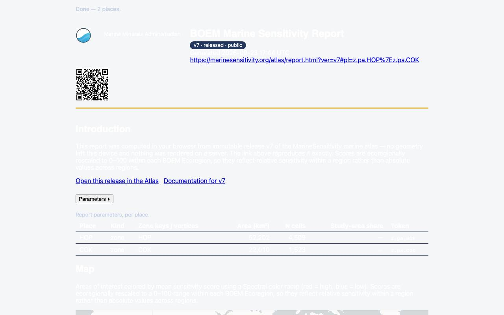

6. **Data package (ZIP)** holds `README.md`, `CITATION.md`, `provenance.json`, `places.geojson`, and
   `scores_*.csv` / `species_*.csv` per place. The scores CSV keeps full precision
   (`bird,38.7198993846831`).
7. **Word document:** `word/document.xml` holds the Table of Scores with the same numbers (HOP 4,509
   cells, 39/48/70/68/84/33/27/—, overall 53; COK 1,523 … 53) and the species summaries, plus two
   images: the map and the flower. **No seal is embedded.** The DOCX has the numbers.
8. **Branding on the report page itself:**
   - The title is **"BOEM Marine Sensitivity Report"** (`src/lib/report/model.ts:69`), under a
     "Marine Minerals Administration" lockup.
   - **The seal is 32 px** (`report.css:116`); D10 and the guide set 72 px as the minimum.
   - `report.html` registers **no web fonts** (`document.fonts` is empty), so it renders in
     Helvetica/Arial, not Jost/Carlito: `report.css` imports `tokens.css` but not `fonts.css`.
   - The export buttons are unstyled browser buttons.

### 3.6 About, "Report a problem", Help, theme

- **"About this release"** is a 372 px card bottom-left, collapsed. Expanded, it shows the seal on its
  white plate beside one sentence of release text (`shell-about-1280-dark.jpg`). Nothing in it links to
  the docs, the changes, the data, or a citation.
- **Help (?)** announces "Guided tour and full help arrive in a later phase — see About below." and
  moves focus to the About card's toggle (`obs-scores.json`, `help`). That puts focus in the far
  corner of the screen, with no visible explanation.
- **"Report a problem"** (bottom-left link) opens `github.com/login?return_to=…/issues/new…`. A
  BOEM/NOAA reviewer without a GitHub account meets a login wall. The prefilled body does carry app
  version, release, lens and viewport, and never the hash.
- **Theme:** the default is `auto` (`types.ts:175`), so an OS set to light gets the paper theme. That
  theme's first paint stayed blank (§2).
  - The toggle's glyph is `mdiThemeLightDark`, and its accessible name speaks brand-internal words:
    "Switch to the paper theme" and "Switch to the navy theme".
  - The URL writes `theme=light`/`dark` while the CSS says `navy`/`paper`: one concept, two
    vocabularies.

  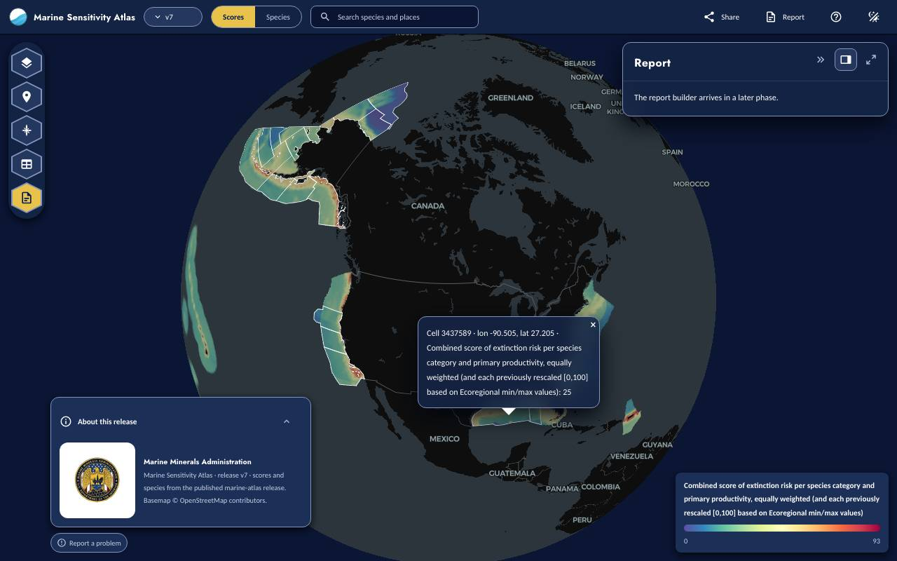

### 3.7 Restricted release, stale links, resize

- **`?ver=v9` on the public host** auto-opens the release picker with a clear notice: "v9 is a
  pre-release under review and is not shown on this host. Continue on the preview host." Behind it,
  v7 renders (`shell-denied-v9-1280-dark.jpg`).
  - On Esc the **welcome modal appears next**, a second modal in a row.
  - The address bar keeps `?ver=v9` while the page shows v7, so Share copies a link that says v9.
  - No request under `/v9/` was made. That matches D6.
- **Resizing** 1280 → 860 → 1280 with the Table tool open kept the tool and the selection. It turned
  the panel into the sheet and back with no horizontal overflow (`obs-viewports.json`,
  `resize-breakpoint`).

  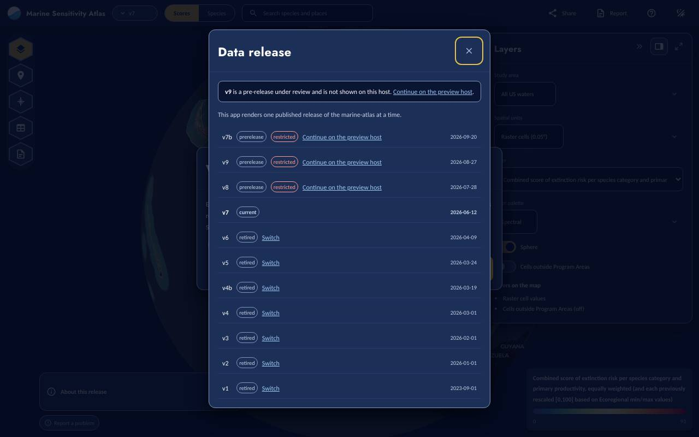

### 3.8 Phone (390×844, touch), tablet and large desktop

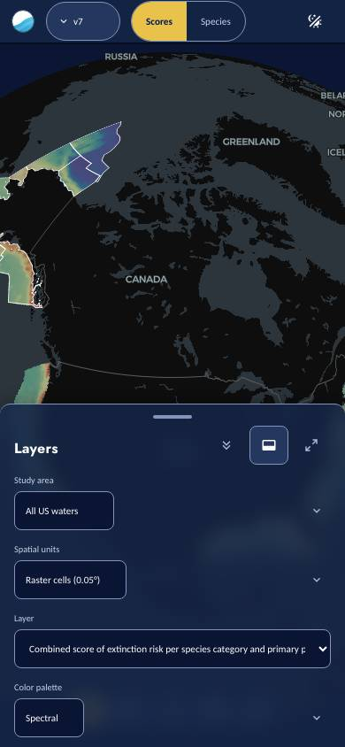

- **The phone bar is thin.** It keeps the mark, version chip, lens switch and theme toggle. Search,
  Share, Report, Help, About, feedback and the legend are all **hidden** (`obs-phone.json`,
  `phone-dark.vis`).
- **The bottom tool rail is never reachable.** It sits at y 772–832; the sheet covers it at peek,
  half and full. `elementFromPoint` at its centre hits the sheet, and tapping "Places" timed out with
  the sheet's content intercepting the tap (`obs-phone.json`; `scores-tapcell-390-dark.jpg`).
  Only the Layers tool is usable.
- **The sheet cannot be dragged.** Its grabber says "Drag to resize the sheet" (`Sheet.svelte:71`)
  but has no handler: dragging it selected text instead of moving the sheet.
- **The camera does not allow for the sheet.** At the default half detent the map shows Canada and
  Greenland; the US study area is under the sheet. The light phone is the same
  (`scores-default-390-light.jpg`).
- **Tapping a scored cell** (Oregon shelf) set `sel=cell:2394292` but showed **no popup within 8 s**.
- **The species lens on the phone has no search at all.** There is no combobox anywhere
  (`species-default-390-dark.jpg`), so a phone user sees the default leatherback and nothing else.
- **At 1024×768 (tablet)** the 380 px panel covers 37 % of the width: the Atlantic coast and the
  eastern Gulf are underneath it (`scores-default-1024-dark.jpg`).
- **At 1440×900** everything fits; the study area still sits left of centre
  (`scores-default-1440-dark.jpg`, `scores-default-1440-light.jpg`).

### 3.9 Keyboard

| Checked                             | Result                                                                                                                                                                                                                                                                                                                    |
| ----------------------------------- | ------------------------------------------------------------------------------------------------------------------------------------------------------------------------------------------------------------------------------------------------------------------------------------------------------------------------- |
| Tab order from the top (40 presses) | Skip to the tools · Skip to the details panel · version chip · Scores · Species · search · Share · Report · Help · theme · **map canvas** · rail (roving: only the active tool) · panel's collapse/half/full · panel body · 4 selects · 2 switches · About · Report a problem · back to the top. 24 stops, logical order. |
| Focus visible                       | A 2 px gold ring on every stop (`shell-kbd-skiplink-1280-dark.jpg`). The search input draws its ring on the pill, not on the input itself.                                                                                                                                                                                |
| Rail arrows                         | ↓/↑/Home/End move within the rail; Enter opens the tool and keeps focus on the rail button.                                                                                                                                                                                                                               |
| Esc                                 | It closes the welcome modal (focus lost to `<body>`) and the version picker (focus returns to the chip). Inside the panel it collapses it to the pill; Enter on the pill restores it.                                                                                                                                     |
| Map                                 | `=` zooms. Arrow keys did not pan the globe in this run. Enter does nothing; a keyboard user cannot pick a cell or zone. The Zones table is the declared equivalent.                                                                                                                                                      |
| Species combobox                    | Type "walrus", ↓ sets `aria-activedescendant`, Enter picks, and "1 result for "walrus"" is announced.                                                                                                                                                                                                                     |
| Lens switch                         | Two buttons, not a radio group: ← → do nothing, and Tab reaches each one.                                                                                                                                                                                                                                                 |
| WebKit                              | Tab reaches only text fields (search) and the canvas unless Safari's "Press Tab to highlight each item" is on. That is WebKit's default, not an app bug.                                                                                                                                                                  |

### 3.10 Engines

Firefox rendered the Program-Area choropleth, the zone outlines and the Table with no console errors
(`scores-table-1280-dark-firefox.jpg`), and WebKit rendered the same. The only console error on every
engine is the documented `session.json` 404 on the public host (D6).

---

## 4. Ranked findings

**B** = blocker (a core task cannot be completed, or the numbers are wrong). **M** = major (the task
completes only by discovery or workaround, or a returning Shiny user loses something). **m** = minor.
**p** = polish. Items marked (known) were already in the atlas-8 phase review of 0.10.21.

| ID  | Sev | Finding (observed)                                                                                                                                                   | Evidence                                                                          | Owner                                                                                                          | Proposed fix (one line)                                                                                                                                           |
| --- | --- | -------------------------------------------------------------------------------------------------------------------------------------------------------------------- | --------------------------------------------------------------------------------- | -------------------------------------------------------------------------------------------------------------- | ----------------------------------------------------------------------------------------------------------------------------------------------------------------- |
| B1  | B   | Place analyses race on shared DuckDB tables: coverage reads 0 / 100 / 200 %, and a place can show another place's scores                                             | `places-cells-1280-dark.jpg`, `obs-coverage-race.json`, `obs-places.json`         | `src/places/results.ts:49-55`; `src/lib/analysis/queries.ts:90-121`                                            | Serialize every place analysis through one per-engine queue (or per-call table names); unit-test two concurrent analyses returning their own counts               |
| B2  | B   | Places footer "Report" drops places whose names contain spaces (every drawn/typed place)                                                                             | `report-places-1280-light.jpg`, `obs-report-hash.json`                            | `src/places/Places.svelte:542`                                                                                 | Build the hash with the same encoder `reportHref()`/`formatSel` use; round-trip test through report.html's parser with "Drawn place 1"                            |
| B3  | B   | Pick mode cannot pick a Program Area (only the 1-px outline is queried)                                                                                              | `places-pick-programarea-1280-dark.jpg`                                           | `src/shell/Shell.svelte:808`; `src/places/pickInstall.ts:45-47`; `src/lib/map/layers/zones.ts:106-111`         | Compose an invisible (opacity 0) query fill for the drawable unit whenever pick mode is on; e2e clicks a polygon's interior                                       |
| B4  | B   | Phone: tool rail beneath the sheet at every detent; no species search on the phone                                                                                   | `scores-tapcell-390-dark.jpg`, `species-default-390-dark.jpg`, `obs-phone.json`   | `src/shell/shell.css:329-340, 393-399, 434`; `src/shell/Shell.svelte:690-710`                                  | Tab bar as its own fixed row with the sheet ending above it; lens-aware search as a sheet header row on the phone                                                 |
| B5  | B   | Download HTML: white text on a light page (no `data-theme` on the exported root); seal remote so missing offline                                                     | `report-offline-1280-light.jpg`, `obs-report.json`                                | `src/report/exportHtml.ts:40`; `src/report/Report.svelte:174-175`                                              | Write `data-theme="paper"` + `color-scheme: light` on the exported `<html>`; inline the seal as a data URI; e2e opens the export offline and checks text contrast |
| M1  | M   | Top-bar Report and the Report tool are placeholders; the working Program-Area report path is Table → Zones → tick → "Report on selected" (known)                     | `scores-reporttool-1280-dark.jpg`, `report-zones-1280-light.jpg`                  | `src/shell/Shell.svelte:202-204`; `src/shell/tools.ts:44-50`                                                   | Report = open report.html for the current selection (zone, place list, or both); with nothing selected, a short chooser                                           |
| M2  | M   | Viridis/Cividis/Magma: grey Program Areas; no legend on cells                                                                                                        | `scores-mammal-viridis-1280-dark.jpg`                                             | `src/lens/scores/zoneFill.ts:63-80`; `src/lens/scores/ScoresLegend.svelte:35-54`                               | Derive stops from `src/lib/raster/ramps.ts` (the single ramp site) when a release publishes none, or offer only published palettes                                |
| M3  | M   | Collapsed panel: scores click dead (known M1); rail clicks do not reopen the panel; pill floats mid-top                                                              | `scores-collapsed-1280-dark.jpg`                                                  | `src/lens/scores/ScoresLens.svelte:133-182`; `src/shell/Shell.svelte:177-180`; `src/lib/ui/Panel.svelte:86-88` | Lens-level click owner (as species); `selectTool()` un-collapses; pill docks to the panel's edge                                                                  |
| M4  | M   | Default camera frames Canada; panel/sheet cover the study area; basemap 8.6–14 s, raster 10–21 s after load, no loader                                               | `scores-default-1280-dark.jpg`, `scores-default-1024-dark.jpg`, `obs-timing.json` | `src/lib/map/interaction.ts:38-44`; `src/lib/map/map.ts:111`                                                   | Frame the study area with `padding` for the panel/sheet (camera.ts already computes padded fits); a honeycomb loader until the first raster tile                  |
| M5  | M   | Tour and Help are stubs; welcome modal is scores copy, shows over every deep link, and `?tour=off` does not suppress it as documented                                | `shell-welcome-1280-dark.jpg`, `species-deeplink-bogus-sp-1280-dark.jpg`          | `src/lens/scores/WelcomeModal.svelte:33-34, 48-49`; `src/shell/Shell.svelte:206-209`                           | driver.js tour (lazy) with the steps in §5; skip the modal when the URL carries view state; a (?) menu                                                            |
| M6  | M   | Panels do not resize, move or maximize; "Full height" = content height; wide tables scroll inside 380 px                                                             | `scores-panelfull-1280-dark.jpg`, `scores-table-1280-dark.jpg`                    | `src/lib/ui/Panel.svelte:86-120`; `src/lib/ui/panelGeometry.ts`                                                | R1: dock left/right/bottom, drag-resize 320–720 px, maximize-to-stage with Esc restore                                                                            |
| M7  | M   | "Report a problem" is a GitHub login wall and sits bottom-left                                                                                                       | `shell-about-1280-dark.jpg`, `obs-scores.json` (`report-a-problem`)               | `src/shell/Shell.svelte:864-883`; `src/lib/feedback/issueUrl.ts`                                               | U3 Send feedback (screenshot + form → Sheet/email/issue) in the top bar; GitHub link as the fallback                                                              |
| M8  | M   | Places panel's Report/Share/Download sit below the panel's scroll fold; rows keep "not analysed yet" after analysis; results do not start by themselves after a draw | `places-upload-1280-dark.jpg`, `obs-report.json`, `obs-coverage-race.json`        | `src/places/Places.svelte:424-440, 675, 706`; `src/places/ResultsPanel.svelte:97-104`                          | Sticky footer; row chip from the finished result; start the analysis on add                                                                                       |
| M9  | M   | Cold cell click: no popup or spinner for > 3.5 s (8 s on the phone)                                                                                                  | `obs-scores.json` (`click-cell`), `obs-phone.json` (`tap-cell`)                   | `src/lens/scores/ScoresLens.svelte:109-131`                                                                    | Open the popup at once with "Loading value…", fill it when the engine answers                                                                                     |
| M10 | M   | Report map does not frame zone places (no `label_pt` on v7); degenerate "53 to 53" ramp                                                                              | `report-zones-full-1280-light.jpg`                                                | `src/report/reportMap.ts:42-53, 103-128`                                                                       | Frame from the zone PMTiles feature bbox (or publish per-zone bbox in `boot`); widen a one-value ramp to the release domain                                       |
| M11 | M   | Seal at 32 px on the report (D10 minimum 72 px); report title "BOEM …" under an MMA lockup; no brand fonts in report.html                                            | `report-zones-1280-light.jpg`, `obs-report.json` (`imgs`)                         | `src/report/report.css:9, 116`; `src/lib/report/model.ts:69`                                                   | Seal ≥ 72 px on its plate; title from `VITE_AGENCY`; `@import` fonts.css                                                                                          |
| M12 | M   | Species lens: Table and Report tools are placeholders, Flower faded; 3 of 5 tools dead (Table is known)                                                              | `obs-species.json` (`species-table`)                                              | `src/shell/Shell.svelte:812-838`; `src/shell/tools.ts:44-50`                                                   | Species Table = per-cell/zone model values; Report = species report; or hide tools a lens lacks                                                                   |
| M13 | M   | Input pills with no published surface are struck through; a returning Shiny user expects to click AquaMaps / IUCN / critical habitat                                 | `species-humpback-1280-dark.jpg`, `compare-shiny-species-1280-dark.jpg`           | `src/lens/species/LayerBarView.svelte:202`                                                                     | "Not published for v7" chip style (muted, no strike) with the reason in the tooltip; publish the input COGs where they exist                                      |
| M14 | M   | No legend, About, Share, Report, Help or feedback on the phone (legend known)                                                                                        | `obs-phone.json` (`vis`)                                                          | `src/lens/scores/ScoresLegend.svelte:69-78`; `src/shell/shell.css:434`                                         | Legend chip above the tab bar; an overflow (⋯) menu for Share/Report/feedback/About/Help                                                                          |
| m1  | m   | Scores search box has no handler (known)                                                                                                                             | `obs-scores.json` (`scores-search`)                                               | `src/shell/Shell.svelte:703-708`                                                                               | Program Area / place / coordinate search, or remove until built                                                                                                   |
| m2  | m   | Zone popup shows codes ("GEO: 34"), no names (data defect 3c)                                                                                                        | `scores-zonepopup-1280-dark.jpg`                                                  | msens `app_bundle_build()` zone rows; `src/lens/scores/popup.ts`                                               | Publish `name`/`label_pt`; popup "St. George Basin (GEO) · 34"                                                                                                    |
| m3  | m   | No hover feedback on Program Areas                                                                                                                                   | `obs-scores.json` (`hover-zone`)                                                  | `src/lib/map/interaction.ts:170-180`                                                                           | Hover outline + name tooltip via `zoneAtPoint`                                                                                                                    |
| m4  | m   | Flower: petals unlabelled; text summary prints raw doubles                                                                                                           | `scores-flower-1280-dark.jpg`                                                     | `src/lib/ui/Flower.svelte`; `src/lib/ui/flowerGeometry.ts:235`                                                 | Petal labels or a keyed legend; one decimal in the summary                                                                                                        |
| m5  | m   | "humpback" → the whale is 6th; 138 px dropdown wraps each row to 3 lines                                                                                             | `species-search-1280-dark.jpg`                                                    | `src/lens/species/data/picker.ts:273-283`; `src/lens/species/SpeciesPicker.svelte:296-360`                     | Tie-break by exact-word common-name match and US presence; dropdown ≥ 360 px                                                                                      |
| m6  | m   | Legacy link writes `rep=undefined&us=0`                                                                                                                              | `obs-species.json` (`deeplink-legacy-mdl_seq`)                                    | `src/lens/species/state.svelte.ts:225`                                                                         | Only set `rep`/`us` when the alias target carries them                                                                                                            |
| m7  | m   | Not-found species: raw "(not-found)" code; bogus `lyr`/`sel=cell` ignored silently                                                                                   | `species-deeplink-bogus-sp-1280-dark.jpg`                                         | `src/lens/species/SpeciesLens.svelte`; `src/lens/scores/state.svelte.ts`                                       | One "this link names something v7 does not have" toast per bad key                                                                                                |
| m8  | m   | Denied `?ver=v9` keeps `ver=v9` in the address bar while v7 renders; welcome modal follows the picker                                                                | `shell-denied-v9-1280-dark.jpg`, `obs-viewports.json`                             | `src/shell/Shell.svelte:257-262`                                                                               | Rewrite the URL to the rendered version (keep the notice); never stack the welcome modal on it                                                                    |
| m9  | m   | Uncaught `programarea_ln does not exist` from the click handler                                                                                                      | `obs-scores.json` (`errors`)                                                      | `src/lib/map/interaction.ts:176-179`                                                                           | Filter the query layer list by `map.getLayer()`                                                                                                                   |
| m10 | m   | Upload/coordinates add a place off-screen without moving the map                                                                                                     | `places-upload-1280-dark.jpg`                                                     | `src/places/Places.svelte:277-295`                                                                             | Fly to the new place (padded) after add                                                                                                                           |
| m11 | m   | Popups run under the panel (species name clipped)                                                                                                                    | `species-clickvalue-1280-dark.jpg`                                                | `src/lib/map/popup.ts`                                                                                         | Pass the panel inset as MapLibre `padding` so popups anchor away from it                                                                                          |
| m12 | m   | "Only species in US waters" is a no-op on v7                                                                                                                         | §1, `app/taxa.json` flags                                                         | `src/lens/species/SpeciesPicker.svelte:237-245`                                                                | Hide the switch when the release has no non-US taxa                                                                                                               |
| m13 | m   | Welcome close drops focus to `<body>`                                                                                                                                | `obs-keyboard.json` (`welcome-esc`)                                               | `src/lens/scores/WelcomeModal.svelte:37-45`                                                                    | Return focus to the map region / first tool                                                                                                                       |
| m14 | m   | Sheet grabber advertises drag and has no drag                                                                                                                        | `scores-tapcell-390-dark.jpg`, `obs-phone.json` (`grabber-drag`)                  | `src/lib/ui/Sheet.svelte:71`                                                                                   | Pointer drag between detents, or drop the "Drag to resize" name                                                                                                   |
| p1  | p   | Native selects: chevron detached from a content-width box                                                                                                            | `scores-default-1280-dark.jpg`, `obs-scores.json` (`layers-selects`)              | `src/lib/ui/Select.svelte:61-70`                                                                               | `width: 100%` on `.select`                                                                                                                                        |
| p2  | p   | Metric names are raw sentences in the select, popup and legend                                                                                                       | `scores-cellpopup-1280-dark.jpg`                                                  | `boot.metrics` labels; `src/lens/scores/LayersPanel.svelte:113-130`                                            | Short label ("Combined score") + the sentence as the (i) description                                                                                              |
| p3  | p   | Theme toggle glyph/labels ("paper"/"navy") and two vocabularies (`light`/`dark` vs `navy`/`paper`)                                                                   | `shell-kbd-skiplink-1280-dark.jpg`                                                | `src/shell/Shell.svelte:742-751`; `src/lib/state/types.ts:18-26`                                               | Sun/moon icons, "Switch to light/dark theme"; one vocabulary in code                                                                                              |
| p4  | p   | Coordinates dialog sample values look pre-filled                                                                                                                     | `places-coords-1280-dark.jpg`                                                     | `src/places/CoordinateDialog.svelte:24-25`                                                                     | Move the examples to help text above the field                                                                                                                    |
| p5  | p   | Report export buttons are unstyled browser buttons                                                                                                                   | `report-zones-1280-light.jpg`                                                     | `src/report/report.css`                                                                                        | Style as the app's buttons (no-print)                                                                                                                             |

**Parity notes for a returning Shiny user** (`compare-shiny-scores-1280-dark.jpg`,
`compare-shiny-species-1280-dark.jpg`):

- Shiny shows Program Area **code labels** on the map, a **geocoder** ("Go to location"), fullscreen,
  zoom, compass, a **scale bar**, a **globe minimap** on Species and **"Zoom to layer"**. The Atlas has
  none of these yet (fiddly bits: map chrome).
- Shiny's top bar has **Scores · Species · Docs · Home · About** and a moon toggle. The Atlas has no
  Docs or Home link (known).
- Shiny's Map / Plot of Scores / Table of Species / Report are peers **as tabs**. The Atlas rail maps
  onto them, but in the Atlas only Map and Table actually work.
- Shiny paints in about 100 s (both apps measured at 107 s here), so the Atlas is far faster to first
  usefulness even at 10–21 s.

---

## 5. Ben's items, answered

**Report.** It is unfinished in two places. The top-bar button and the rail tool are placeholders
(M1), and the one live path from the Places panel drops drawn places (B2). What a user expects is
that "Report" reports on **what is selected now**:

- a clicked zone (`sel=zone:…`) or ticked zones;
- the Places list;
- with nothing selected, a small chooser: "Pick a Program Area on the map, draw an area, or choose
  from the list".

The report page itself is good once reached: numbers match, four formats, DOCX with numbers. It
needs B5, M10 and M11. Keep "Report" as the **primary button in the top bar** and drop the rail's
Report tool (it duplicates the top bar and wastes a rail slot), or make the rail tool the chooser
itself.

**"Take a tour".** There is no driver.js yet. The anchors already exist: `data-tour=` on `topbar`,
`brand`, `version-chip`, `lens-switch`, `search`, `share`, `report-top`, `help`, `theme`, `map`,
`rail`, `panel`, `about`, `feedback`. Steps proposed (each ≤ 2 sentences; `?tour=off` suppresses;
(?) → "Take a tour" replays; state snapshot/restore like CalCOFI `src/tour.ts`):

- **Scores (8):**
  1. The map: "Colour is the combined sensitivity score for each 0.05° cell of US waters (red high,
     blue low)." (map + legend)
  2. The release: "You are looking at release v7; other releases are here." (version chip)
  3. The lenses: "Scores ranks places; Species shows one species' distribution." (lens switch)
  4. Layers: "Choose the score layer, Program Areas or cells, and the colour ramp." (rail → Layers)
  5. Click: "Click a cell or a Program Area for its score and its flower." (map, with a scripted click
     on GAA)
  6. Table: "Every Program Area ranked; tick some and report on them." (rail → Table → Zones)
  7. Places: "Draw your own area, enter coordinates or upload a file." (rail → Places)
  8. Report and share: "Report builds a printable, downloadable report for what you selected; Share
     copies this exact view." (Report + Share)
- **Species (5):**
  1. Search: "Find a species by common or scientific name." (search)
  2. The card: "The merged model and the inputs it combines." (layer bar)
  3. The map: "Click anywhere for the modelled value." (map)
  4. The legend: "What 1–100 means." (legend)
  5. Back: "Switch to Scores to see how this species contributes." (lens switch)

**Panels (full screen, resize, move).** None of these exist today. "Full height" means content height
(M6). The recommendation is R1: one dockable panel with maximize and resize. §6 and §7 explain why
not floating windows.

**About and "Report a problem" bottom-left.** They crowd the map's most useful free corner (legend
and scale) and they disappear on the phone. The feedback link hits a GitHub login wall. The
recommendation is R2: (i) About and "Send feedback" in the top bar; on the phone, a ⋯ menu.

**Theme default and toggle.** Today the default is `auto` and the toggle is a light/dark glyph
labelled "paper"/"navy". The recommendation: dark (navy) by default, which matches both Shiny apps
and the brand's dark lockup, with a CalCOFI-style sun ⇄ moon button. `?theme=` and the pre-paint
script stay. In code, pick one vocabulary (`light`/`dark` in the URL and the UI, `navy`/`paper` only
as token-set names).

**Light theme: slate grey vs on-brand yellow.** The paper theme reads slate in two ways:

- its active states use Steel (`--mma-steel`), because gold on white is 1.7:1;
- its neutrals are blue-greys (`#f2f5f9`, `#eef2f8`, `#5d6d92`, the `#223252` scrim).

Candidate **y1** (R5) makes the paper theme's active fill the **same brand gold as the dark theme**,
with a navy ring carrying the state for WCAG 1.4.11, and warms the neutrals to cream. It passes the
contrast gate. See §7 R5.

**The hexagon rail and the top-left logo.**

- **The rail.** Five icon-only hexes in a rounded pill, with meaning only in tooltips. They read as
  decoration rather than tools; a first-timer has to hover each. Recommendation R4: a labelled
  vertical stack. The hexagon survives as the **logo** and as the active marker.
- **The logo.** Today it is a round blue "wave in a circle" that looks like a generic weather icon at
  28 px (`scores-default-1280-dark.jpg` top-left). The wave-in-hexagon (R5) ties the mark to the
  guide's hexagon + wave motifs. It should come out of the same generator as every other product mark
  (`server/branding/make_branding.py`), not be hand-drawn in the atlas.

**What "Layers" means today and what it could mean.**

- **Today** the Layers tool is "this lens's controls": study area, units, metric, palette, projection
  and the outside-PA toggle, followed by a **non-interactive** bullet list titled "Layers on the map".
- **CalCOFI's Layers card** is a **stack**: the data layer with on/off, opacity and ramp; sea floor
  (relief, depth colour, contours); basemap labels; then "On the map", reorderable with ▲▼ and drag,
  plus "Add a layer" (`compare-calcofi-layers-1280-light.jpg`).
- **Recommendation R3:** make Layers the stack, with the lens's data layer as its first row, expanding
  into today's controls. Two icons would split one mental model across two rail slots.

---

## 6. Proposed shell layout

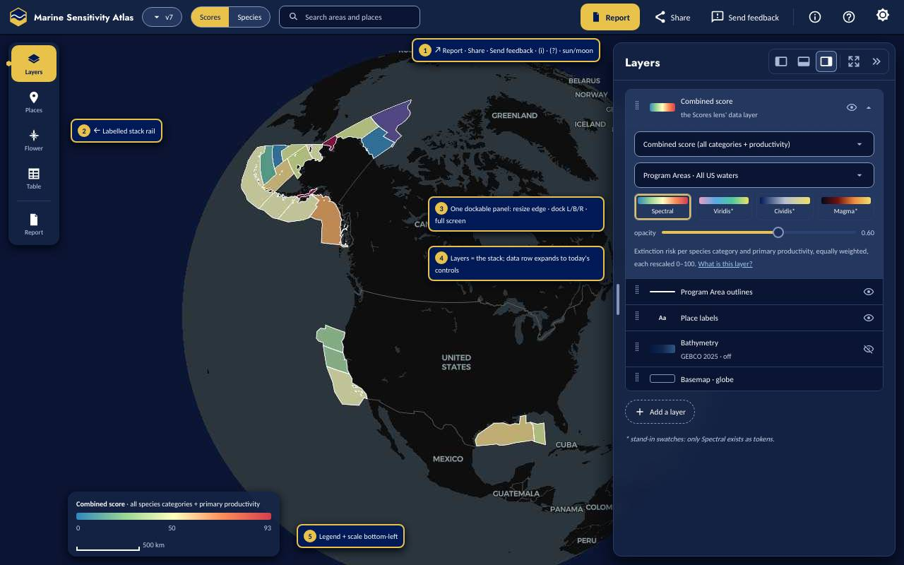
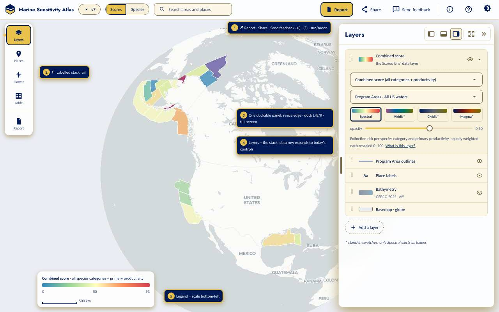
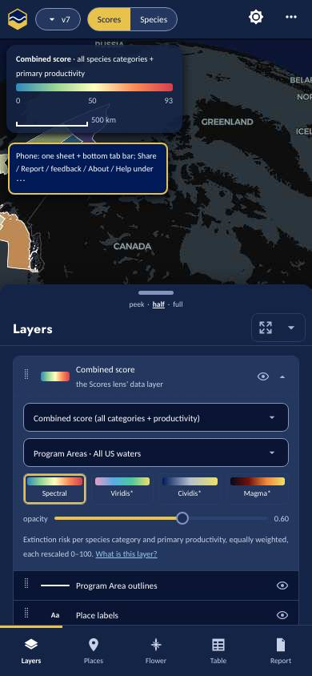

The mockup is `docs/design/mockups/r2/shell.html?chrome=proposed&rail=stack&layers=stack&panel=dock&notes=proposed`.
The numbered callouts in it are these:

1. **Top bar, right: `Report` (primary) · Share · Send feedback · (i) · (?) · sun/moon.** The primary
   action is the one the product exists for. About and feedback get fixed, predictable homes. Help
   carries the tour, the docs link (missing today, known) and keyboard shortcuts.
2. **A labelled stack rail, with no hexes.** Words under icons remove the hover-to-learn step. Five
   tools stay five: Layers, Places, Flower, Table, plus Report (or remove Report if the top bar owns
   it).
3. **One dockable panel.** It docks left, bottom or right, resizes by dragging its edge, maximizes to
   the whole stage (Esc restores) and collapses to an edge pill; clicking any rail tool reopens it.
   Layout is chrome (localStorage per viewport), never the URL (round 1's rule, kept).
4. **Layers = the stack.** The data layer row first, then outlines, labels, bathymetry and basemap,
   each with visibility, opacity and ramp where they apply.
5. **The legend and scale bar own the bottom-left.** The camera is padded by the panel's width (desktop)
   or the sheet's height (phone), so the study area always lands in the visible map.

**Why this, and not CalCOFI's floating cards or Shiny's sidebar:**

- **CalCOFI** shows up to four views at once: Controls, Time, Depth and Layers are all live
  simultaneously and each needs its own box (`compare-calcofi-layers-1280-light.jpg`). The Atlas shows
  **one tool at a time** beside the map. Floating cards would buy window management (overlap, lost
  cards, keyboard move and resize, focus order) without a second simultaneous view to justify it. At
  1280×800 two cards already cover half the Program Areas (`mock-r1-float-1280-dark.jpg`). Below
  900 px both models become the same sheet anyway (`mock-r1-dock-390-dark.jpg`,
  `mock-r1-float-390-dark.jpg`). Borrow what CalCOFI proves works:
  - maximize with Esc restore
  - collapse to a labelled edge pill
  - per-viewport memory
  - the layer stack and ramps
  - sun/moon
  - screenshot feedback
  - the driver.js tour with state restore
- **Shiny** (`compare-shiny-scores-1280-dark.jpg`) puts controls in a fixed left sidebar and the Map,
  Plot, Table and Report as tabs of one card. Returning users know that the map is never covered and
  that Table and Report are one click away. The docked, padded panel keeps the first property and the
  labelled rail keeps the second. The top-bar Report restores Shiny's "Report" tab as a first-class
  action.

---

## 7. Decisions R1–R5 (mockups + recommendation)

All mockups are static, dependency-free HTML under `docs/design/mockups/r2/`. They are never imported
by the app (D13). They are built from `src/lib/brand/tokens.css` only, with no colour literal (the
`check-hex-literals` gate scans that directory and passes). Axe runs over all 18 mockup states,
`node scripts/axe-mockups.mjs --set=r2`: **0 critical, 0 serious**. Screenshots are regenerated by
`node scripts/mockup-shots-r2.mjs`. One page renders every option from its query string, so options
differ only in the thing being decided:

- `panel=dock|float`
- `dock=right|left|bottom|full`
- `rail=hex|stack|top`
- `chrome=now|proposed`
- `open=about|help|feedback`
- `layers=split|tabs|stack`
- `tokens=current|y1|y2|y3`
- `mark=current|wavehex`

Table values, the flower and the citation wording in the mockups are illustrative, and labelled as
such.

### R1 · Panel model

| Dockable panel                                          | Floating windows (CalCOFI cards)                     |
| ------------------------------------------------------- | ---------------------------------------------------- |
| 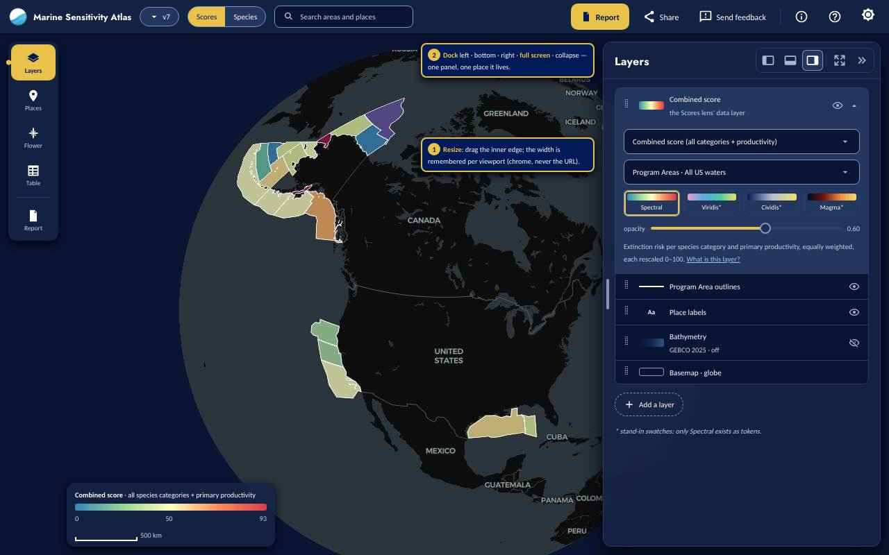     | 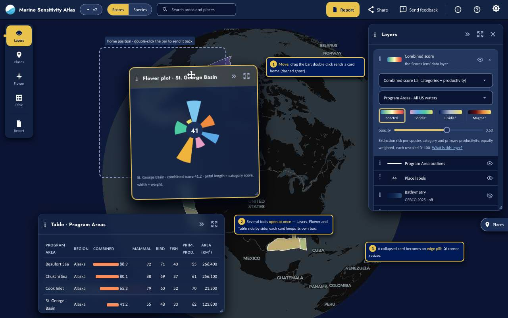      |
| 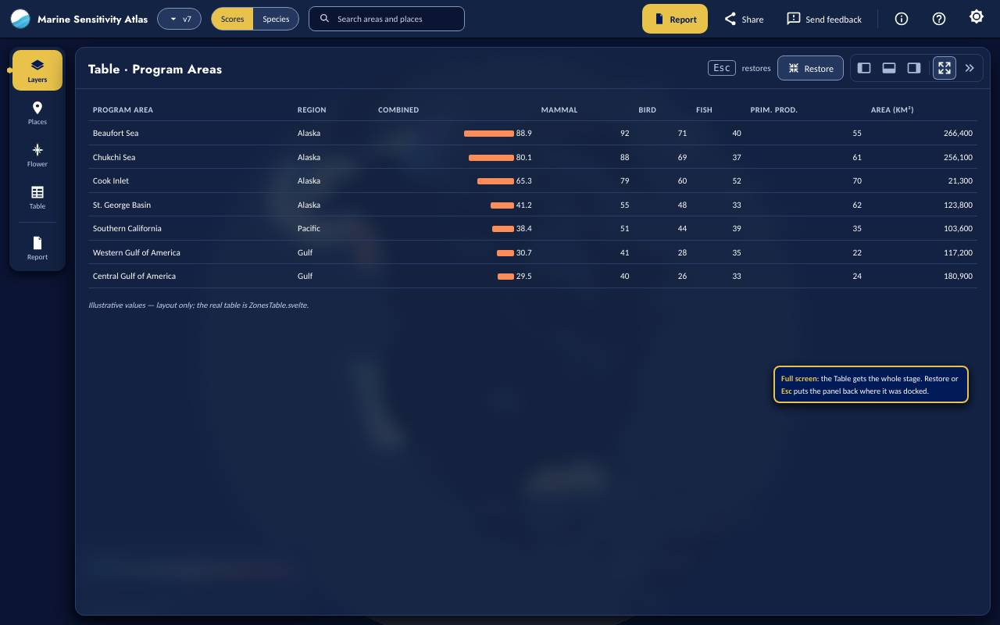 | 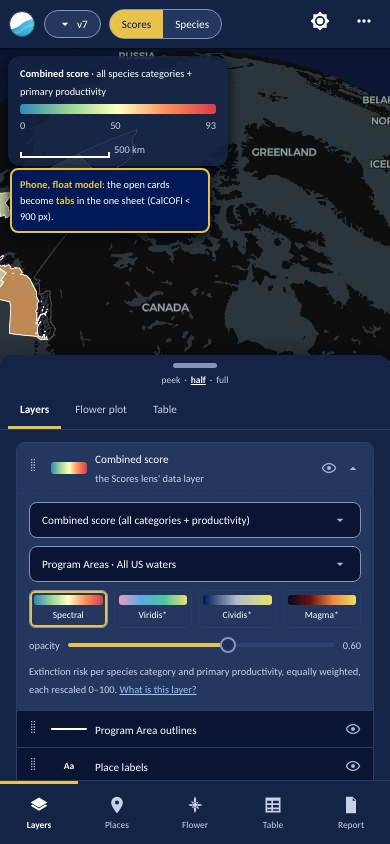 |
| 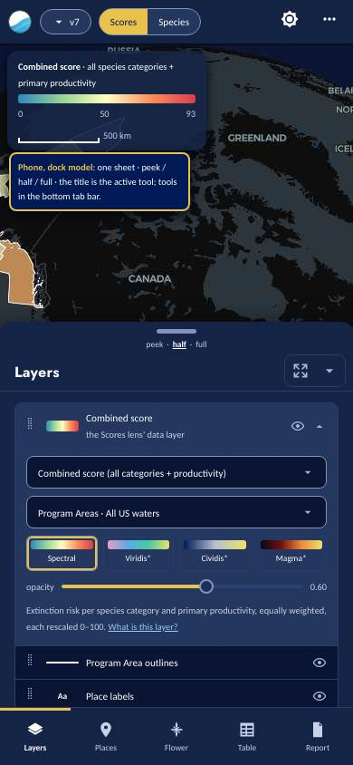      |                                                      |

**Recommendation: one dockable panel** (left/right/bottom, drag-resize, maximize, edge-pill collapse).

- The Atlas has one active tool at a time, and every screen studied needs the map plus one panel.
- The pain points observed are width (the Table) and "I want this bigger" (M6). Resize and maximize
  solve both, as the full-screen Table shows.
- Floating windows add a window manager to build, test and make keyboard-accessible, and on the phone
  they degrade to the same sheet anyway.
- If a real need for two panels at once appears (Flower beside Table), a later "pop out" can add a
  second docked slot.

### R2 · Where About and feedback live

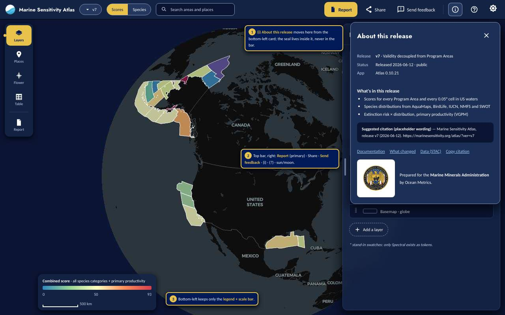
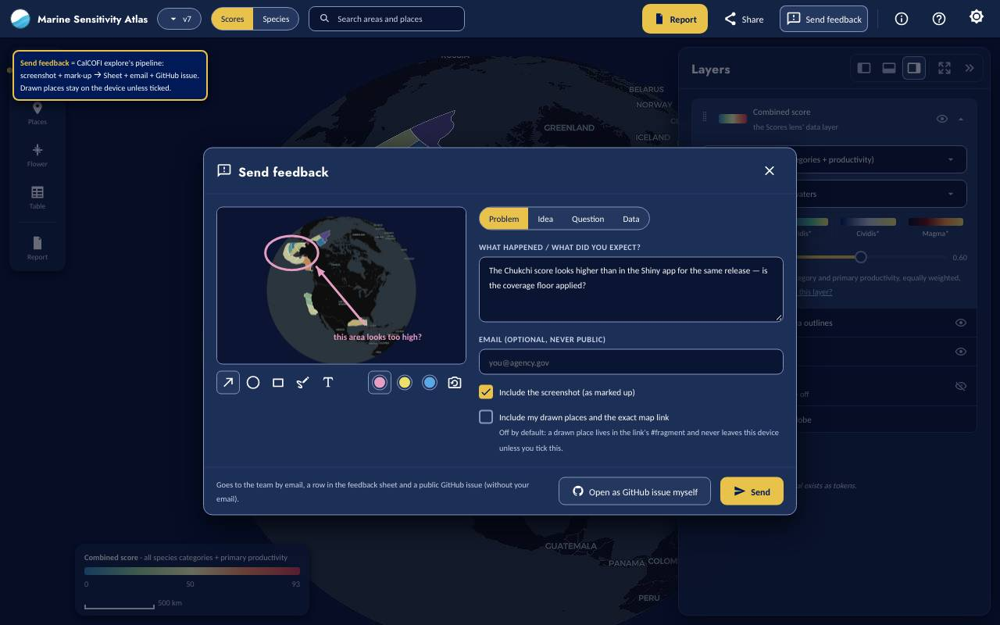

**Recommendation: Ben's suggestion.** An **(i)** button top-right opens "About this release" as a
popover-dialog, and a labelled **"Send feedback"** button sits in the top bar. On the phone, both go
into a ⋯ menu.

- The About popover holds the release, status, app version, "what's in this release", the suggested
  citation, and links to docs, changes, data (STAC) and copy-citation. It shows the seal on its white
  plate at ≥ 72 px, per D10: never in the bar.
- "Send feedback" opens the CalCOFI-style dialog: screenshot plus annotation, a kind, text, and an
  optional email. **"Include my drawn places and the exact map link" is unchecked by default**, the
  privacy rule. "Open as GitHub issue myself" is the zero-backend fallback.
- Why: fixed, predictable homes; no GitHub account needed; the bottom-left corner goes back to the map.

### R3 · The Layers split

| Two icons (Layers stack + Layer info)           | One panel, two tabs                           | One stack, data row expands                     |
| ----------------------------------------------- | --------------------------------------------- | ----------------------------------------------- |
| 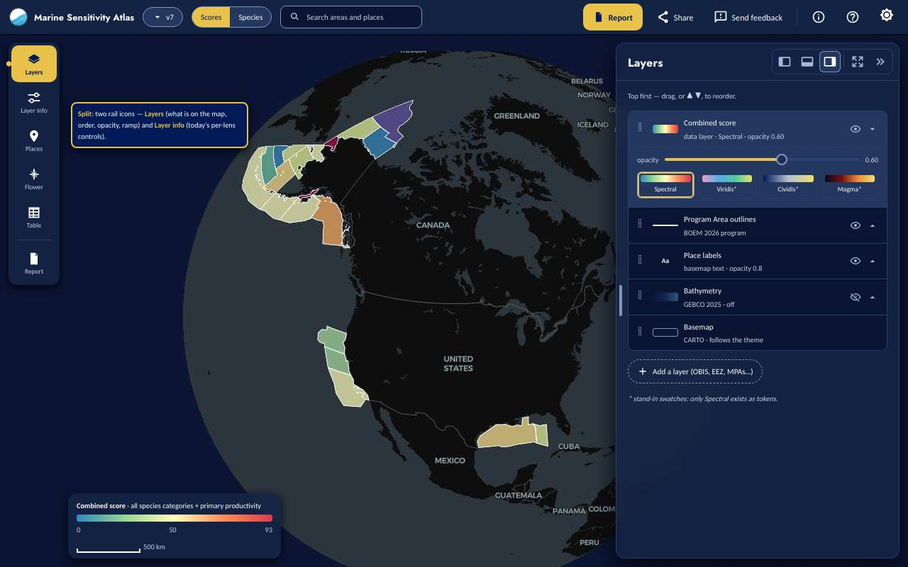 | 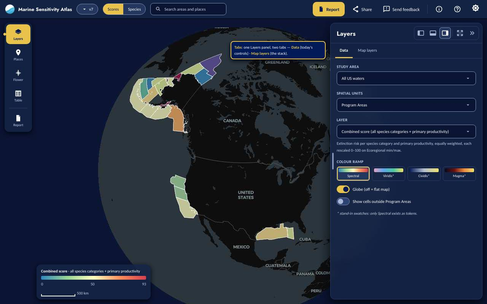 | 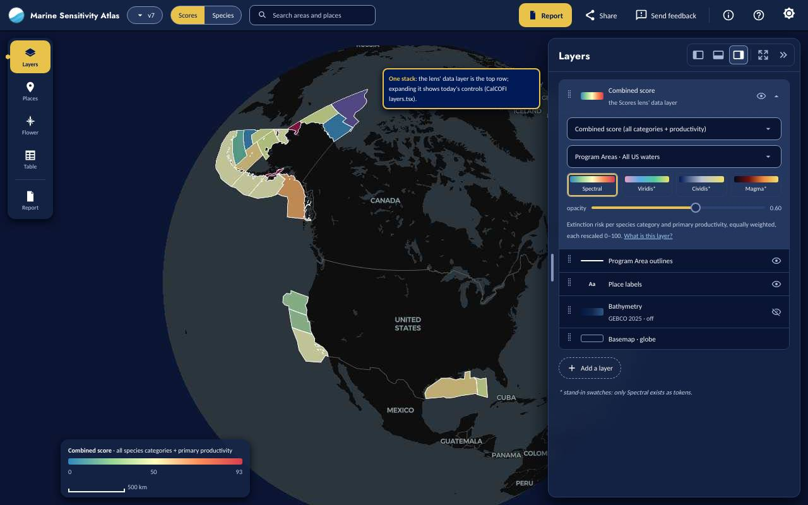 |

**Recommendation: one Layers panel that _is_ the stack, its first row the lens's data layer** (the
third mock). Expanding that row shows today's per-lens controls: layer, units and area, ramp, opacity,
and "What is this layer?".

- Of the two offered options, choose **tabs over two icons**.
- Why: the stack lists what is on the map **in draw order**, which is what the icon promises. The data
  layer's own settings are one click away in the row that owns them.
- The rail stays at five tools. Tabs would hide the stack behind a click, and two icons would split
  one concept across two rail slots and push the rail to six.

### R4 · Tool rail

| Interlocking hexagons                       | Vertical labelled stack                         | Horizontal top bar                           |
| ------------------------------------------- | ----------------------------------------------- | -------------------------------------------- |
| 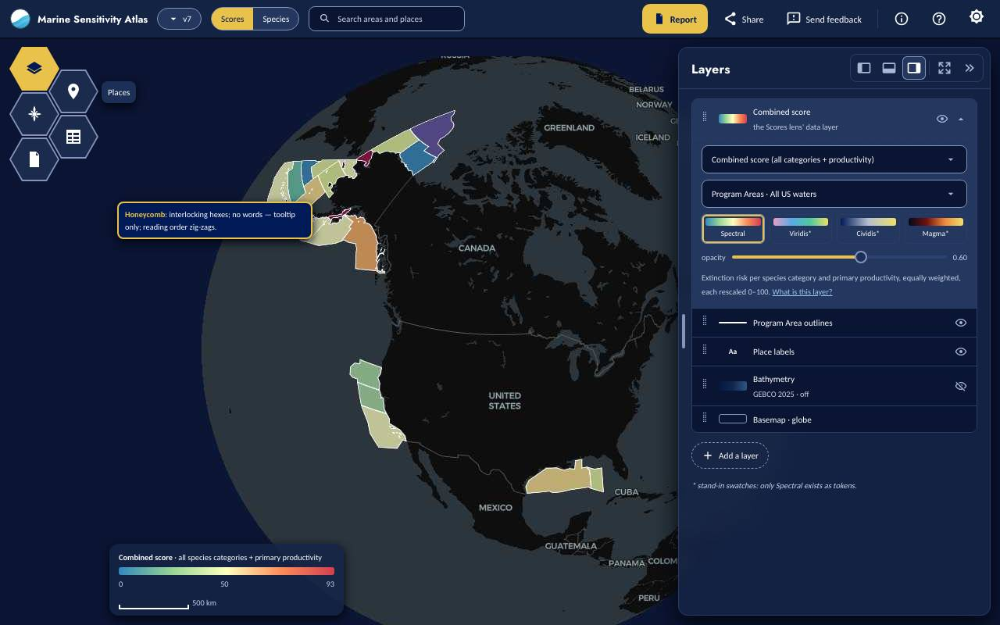 | 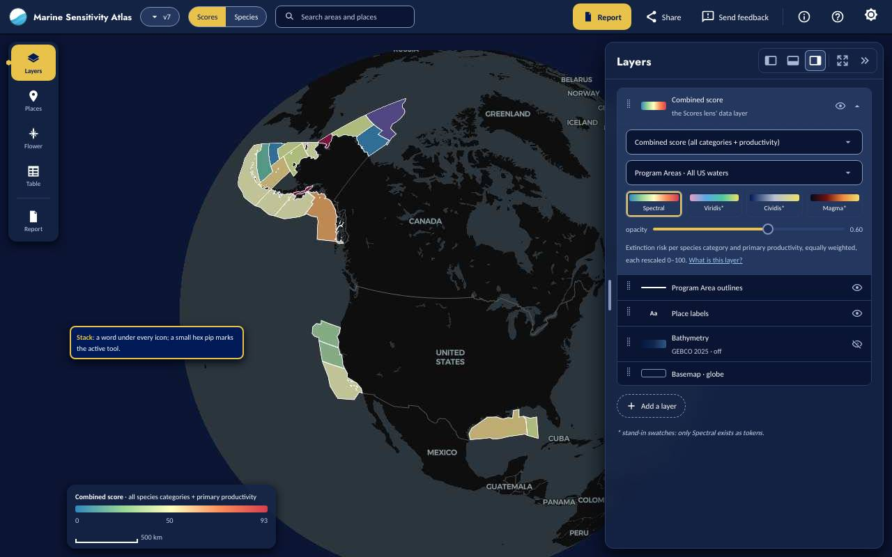 | 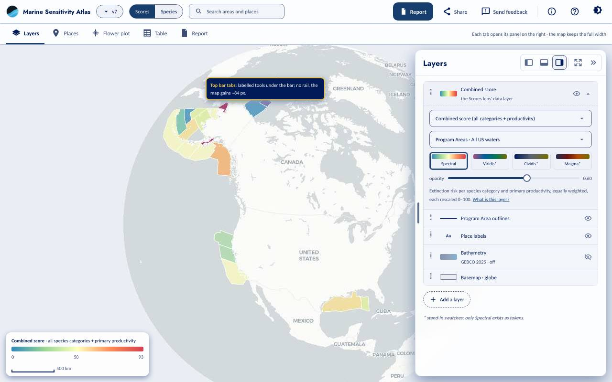 |

**Recommendation: the vertical labelled stack** (desktop), and a bottom tab bar on the phone that the
sheet ends above (fixes B4).

- **The honeycomb** has no words and zig-zag reading order (Layers → Places → Flower → Table → Report
  alternates columns), and its hit shapes are irregular. It is on-brand but costs findability.
- **The top-bar tabs** give the map its full width but take a second row (~44 px) from an 800 px-tall
  screen, and they compete with the top bar's own actions.
- **The stack** is scannable, labelled, and five fixed items. The hexagon motif moves to the logo and
  the active marker, where it reads as brand rather than as a puzzle.

### R5 · Logo and light-theme yellow

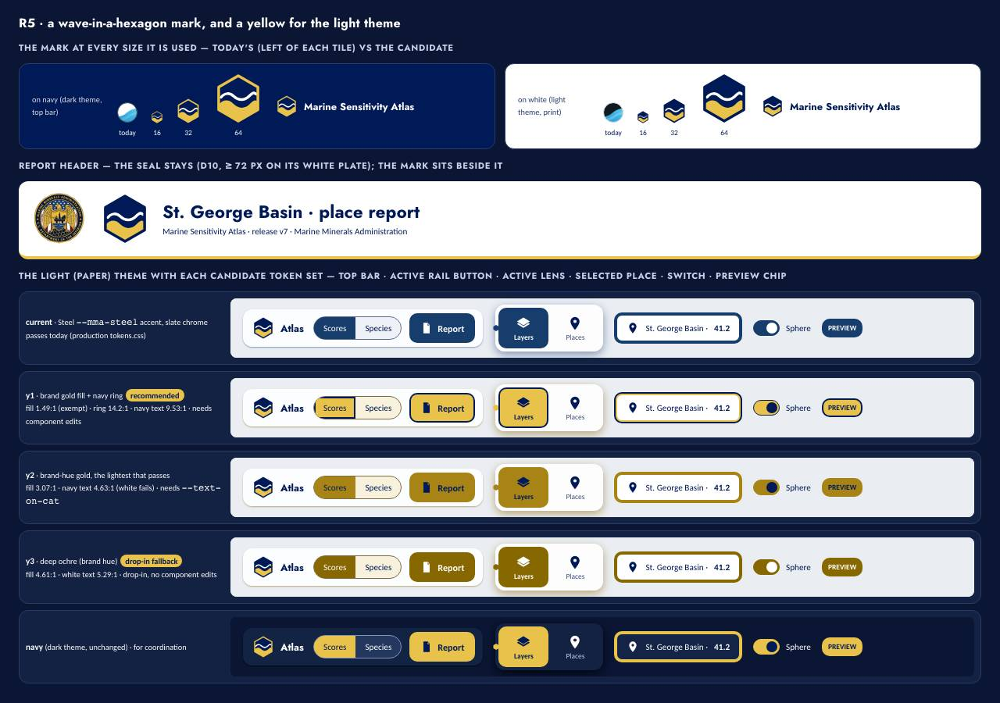
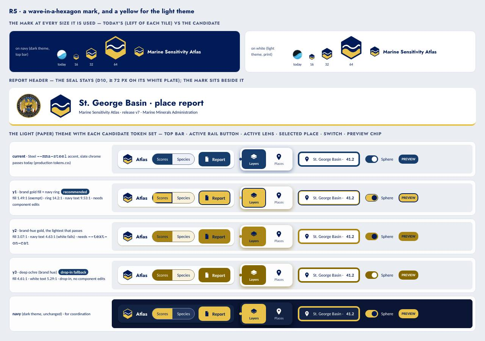

**Mark.** Recommend the **wave-in-hexagon**: a navy or gold hexagon with two wave lines, shown at
16/32 px (favicon), 28 px (top bar) and 64 px (report header, beside the seal, which stays per D10).
The standalone candidate is `docs/design/candidates/mark-wave-hex.svg`; one file serves both themes
through `prefers-color-scheme`. It should be produced by `server/branding/make_branding.py`, so the
Atlas, docs and apps share one mark, and then vendored into `src/lib/brand/vendor/` like today's.

**Yellow.** Three candidates, each a full copy of `tokens.css`, only the paper block changed. The
contrast gate reads each exactly like production (`node scripts/contrast.mjs docs/design/candidates/tokens-yN.css`):

| Candidate | Paper `--fill-accent`                                    | Fill vs panel / map                                                                  | Text on the fill             | Gate              | Component edits                           |
| --------- | -------------------------------------------------------- | ------------------------------------------------------------------------------------ | ---------------------------- | ----------------- | ----------------------------------------- |
| current   | Steel `#173d6d`                                          | passes                                                                               | white                        | PASS 86 pairs     | —                                         |
| **y1**    | **brand gold `var(--mma-gold)` `#e8c24a`** + a navy ring | 1.49:1 → exempt; the ring carries the state (14.23 panel / 16.34 raised / 14.02 map) | navy 9.53:1                  | **PASS 88 pairs** | about 10 selectors add the ring           |
| y2        | `#a78415` (lightest brand-hue gold that passes alone)    | 3.07 / 3.03                                                                          | navy 4.63 (white 3.53 fails) | PASS 86           | 2 (a `--text-on-cat` split, one text use) |
| y3        | `#876700` deep ochre                                     | 4.61 / 4.54                                                                          | white 5.29                   | PASS 86           | none (drop-in)                            |

All three also replace the slate neutrals with warm cream:

| Token              | Current   | Candidate         |
| ------------------ | --------- | ----------------- |
| `--surface-sunken` | `#f2f5f9` | `#fbf6e6`         |
| `--fill-control`   | `#eef2f8` | `#f8f1dc`         |
| `--fill-track`     | `#dde5f0` | `#ece0bd`         |
| `--divider`        | `#d7dfec` | `#e6dab4`         |
| `--border-control` | `#5d6d92` | `#7a6a45`         |
| `--icon-muted`     | `#56658a` | `#6a5c3a`         |
| `--icon-inactive`  | `#6b7793` | `#7d7155`         |
| `--scrim`          | `#223252` | `var(--mma-navy)` |
| `--shadow-color`   | `#8595b4` | `#b8a67a`         |

Every changed pair passes: `--border-control` 4.53–5.28:1, `--icon-muted` 5.71/6.55, `--icon-inactive`
4.19/4.26.

**Recommendation: y1.**

- It is the only candidate whose light-theme active state is the **same gold as the dark theme's**. So
  the two themes coordinate, and it reads as the brand, not mustard (y2) or olive (y3).
- It is honest under WCAG 1.4.11 because the state is carried by a navy `--border-accent` ring at
  ≥ 14:1, and the gate enforces it as a `nontext` pair.
- The price is one mechanical round adding that ring wherever `--fill-accent` marks a state:

  | File                  | Line(s)  |
  | --------------------- | -------- |
  | `HexButton.svelte`    | 153      |
  | `Segmented.svelte`    | 59       |
  | `Switch.svelte`       | 54       |
  | `Pill.svelte`         | 126      |
  | `Chip.svelte`         | 69       |
  | `Places.svelte`       | 814, 849 |
  | `LayerBarView.svelte` | 124, 193 |
  | `Treemap.svelte`      | 244      |

  In the same round, `LayerBarView.svelte:143` stops using `--fill-accent` as text, and
  `Treemap.svelte:273` moves to `--text-on-cat`.

- If that round is unwanted, **y3** is the drop-in fallback.

**y1's token changes in `src/lib/brand/tokens.css`, paper block:**

- `--fill-accent` → `var(--mma-gold)`
- `--text-on-accent` → `var(--mma-navy)`
- new `--border-accent` (navy; gold in the navy block)
- new `--text-on-cat` (white; category-fill labels)
- the nine neutrals above
- in the `@contrast` manifest:
  - `nontext --border-accent` replaces `nontext --fill-accent`
  - `--fill-accent` moves to `exempt`
  - `--text-on-accent` pairs with `--fill-accent`
  - add `text --text-on-cat`

`--focus-ring` stays Steel on paper (gold would fail 3:1 there).

---

## 8. For R6 (Send feedback) and R7 (cutover)

**What Send feedback needs from Ben** (CalCOFI's generator, `calcofi4r/R/feedback.R`, with a msens
twin):

- **Owner.** The Google account that owns the new **Sheet** and the **Apps Script** web app (it runs
  "as me"): ben@oceanmetrics.io, or a shared project account that survives staff changes.
- **Screenshots.** A Drive folder (`DRIVE_FOLDER_ID`).
- **Recipients.** The `recipients` tab: who is emailed per submission (Ben; Tim White for review
  feedback?).
- **GitHub.** A fine-grained token with contents + issues on `MarineSensitivity/atlas` (and on
  `MarineSensitivity/docs`, if docs feedback files there). Screenshots are committed to
  `feedback/<id>.png`, so **the issues and images are public**.
- **Labels.** Proposed: `feedback` plus one of `bug` / `idea` / `question` / `data`, plus the product
  (`atlas` / `docs`) and `release:v7`.
- **Restricted releases (decide explicitly).** Feedback sent from the preview host is about a
  **restricted** release. A public issue carrying a screenshot of v8/v9 would publish what the review
  gate hides. Recommend that the Apps Script skip the public issue (Sheet + email only) when
  `release.access === "restricted"`, or file into a private repo.
- **Rate cap** `MAX_PER_HOUR` and the honeypot, kept.

**What blocks the cutover date (R7):**

1. **Ben's signature on the parity page.** The page is stale: it is stamped 0.10.17, G-23 and G-25 are
   listed open though fixed, G-24 is mislabelled, and eight differences have no line (atlas-8 review
   M7). Regenerate it (`npm run parity:shots -- --side atlas`, `parity:page`, `parity:page:check`)
   after the fixes below land.
2. **B1–B5 from this document.** The Shiny apps let a user report on a Program Area and use the
   species picker on a phone; the Atlas must at least match those before `/scores` and `/species`
   redirect to it. B1 (wrong numbers) is a hard stop on its own.
3. The top-bar Report (M1) and the Take-a-tour stub (M5). Both are visible on the first screen; a
   cutover that ships them as placeholders reads as unfinished to every returning user.
4. atlas-9 part a deployed (the preview host; Ben's `DEPLOY_CADDY` after `chown /share/atlas_preview`),
   the `DEPLOY_ATLAS` / `CHECK_PREVIEW` chunks, and `msens::product_urls()` atlas entries.

---

## Appendix: screenshot index

This document embeds or cites 62 files (4.3 MB). Walk shots are `<lens>-<state>-<viewport>-<theme>.jpg`;
mockups are `mock-*`; reference apps are `compare-*`.

- **Shell:**
  - `shell-welcome-1280-dark`
  - `shell-welcome-390-dark`
  - `shell-versionpicker-1280-dark`
  - `shell-about-1280-dark`
  - `shell-denied-v9-1280-dark`
  - `shell-kbd-skiplink-1280-dark`
- **Scores:**
  - `scores-default-{1280,1440,1024,390}-dark`
  - `scores-default-{1280,1440,390}-light`
  - `scores-cellpopup-1280-dark`
  - `scores-flower-1280-dark`
  - `scores-table-1280-dark`
  - `scores-table-1280-dark-firefox`
  - `scores-treemap-1280-dark`
  - `scores-zonepopup-1280-dark`
  - `scores-mammal-viridis-1280-dark`
  - `scores-panelfull-1280-dark`
  - `scores-collapsed-1280-dark`
  - `scores-reporttool-1280-dark`
  - `scores-tapcell-390-dark`
- **Species:**
  - `species-search-1280-dark`
  - `species-humpback-1280-dark`
  - `species-clickvalue-1280-dark`
  - `species-deeplink-bogus-sp-1280-dark`
  - `species-default-390-dark`
- **Places:**
  - `places-empty-1280-dark`
  - `places-pick-programarea-1280-dark`
  - `places-draw-1280-dark`
  - `places-cells-1280-dark`
  - `places-coords-1280-dark`
  - `places-upload-1280-dark`
  - `places-share-1280-dark`
- **Report:**
  - `report-places-1280-light`
  - `report-zones-1280-light`
  - `report-zones-full-1280-light` (a full page, halved)
  - `report-offline-1280-light`
- **Reference apps:**
  - `compare-shiny-scores-1280-dark`
  - `compare-shiny-species-1280-dark`
  - `compare-calcofi-layers-1280-light`
  - `compare-calcofi-feedback-1280-light`
- **Mockups:**
  - `mock-r1-{dock-right,dock-full,float}-1280-dark`
  - `mock-r1-{dock,float}-390-dark`
  - `mock-r2-{about,feedback}-1280-dark`
  - `mock-r3-{split,tabs,stack}-1280-dark`
  - `mock-r4-{hex,stack}-1280-dark`
  - `mock-r4-top-1280-light`
  - `mock-r5-brand-1280-{dark,light}`
  - `mock-proposed-1280-{dark,light}`
  - `mock-proposed-390-dark`
